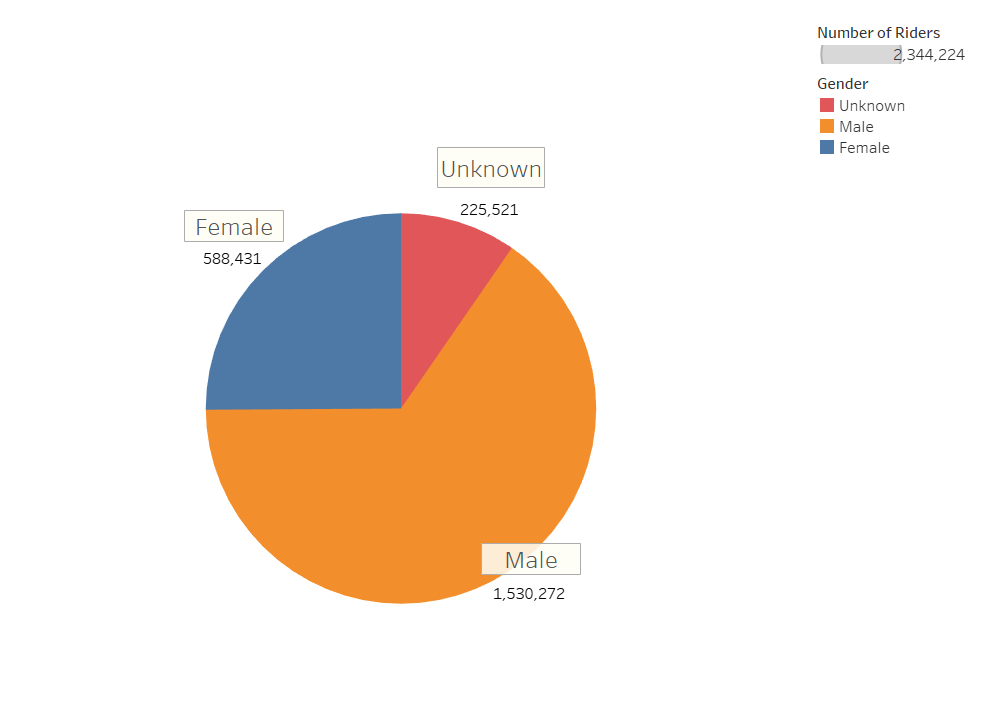
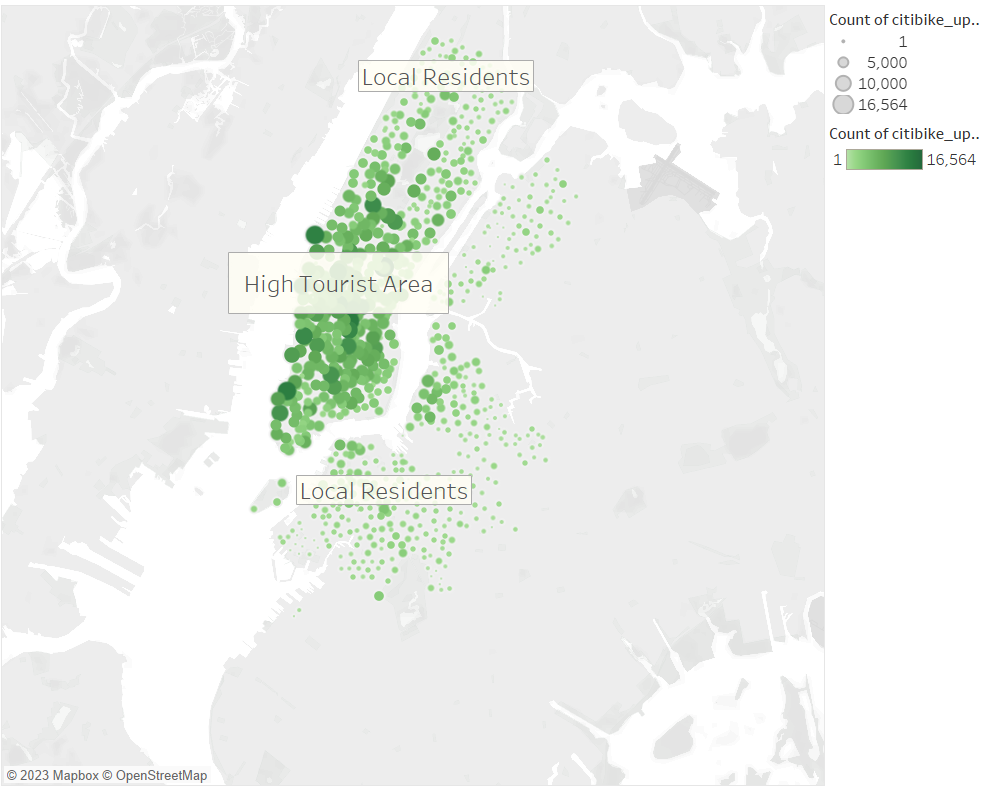
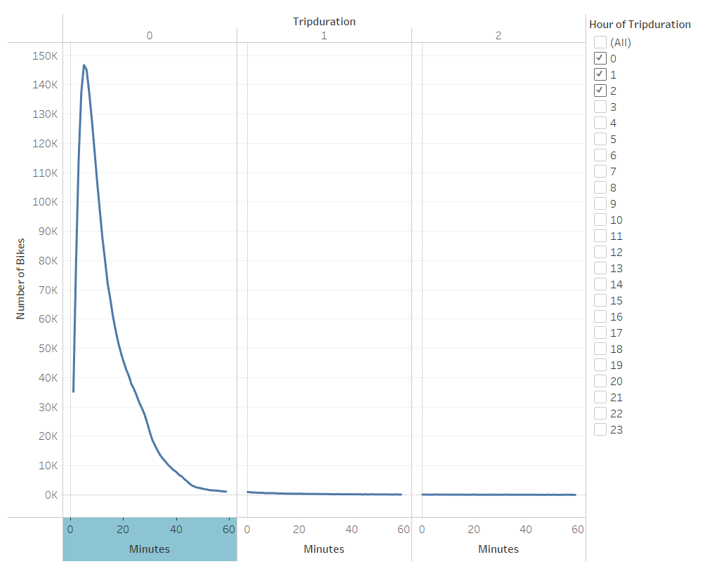
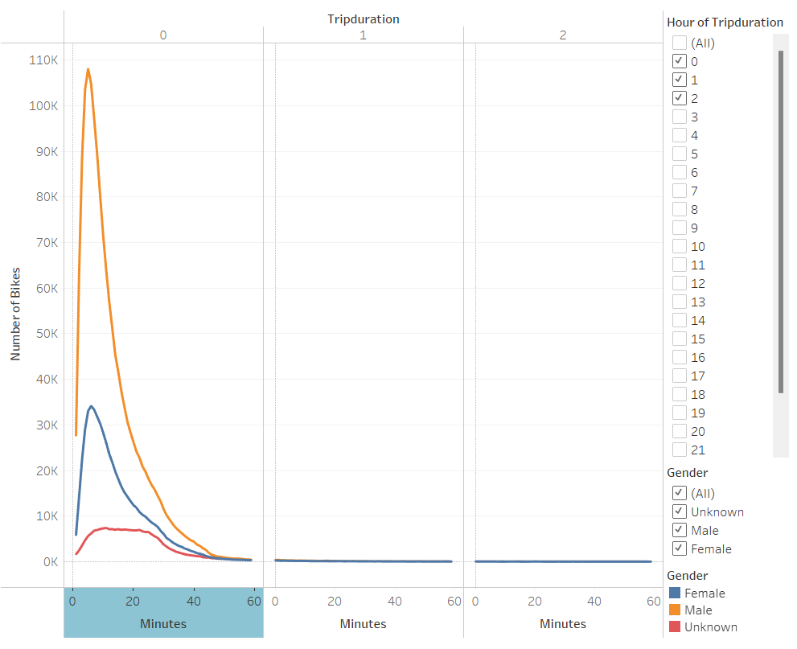
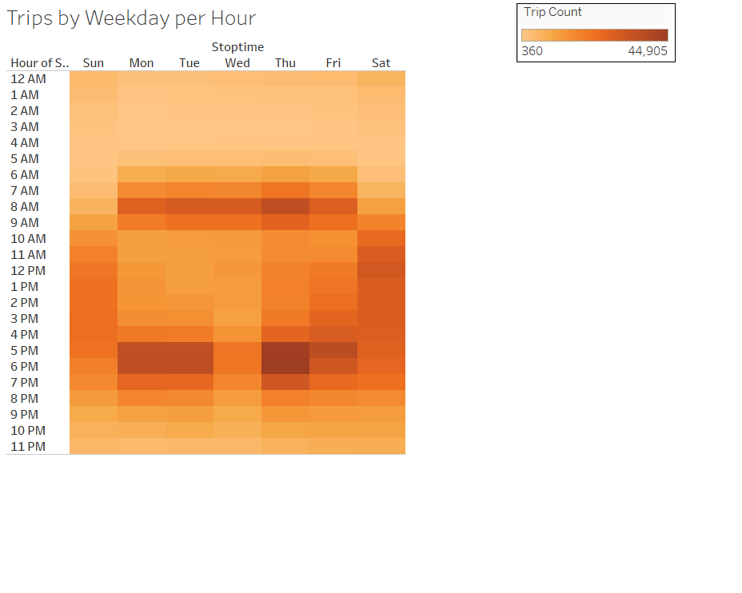
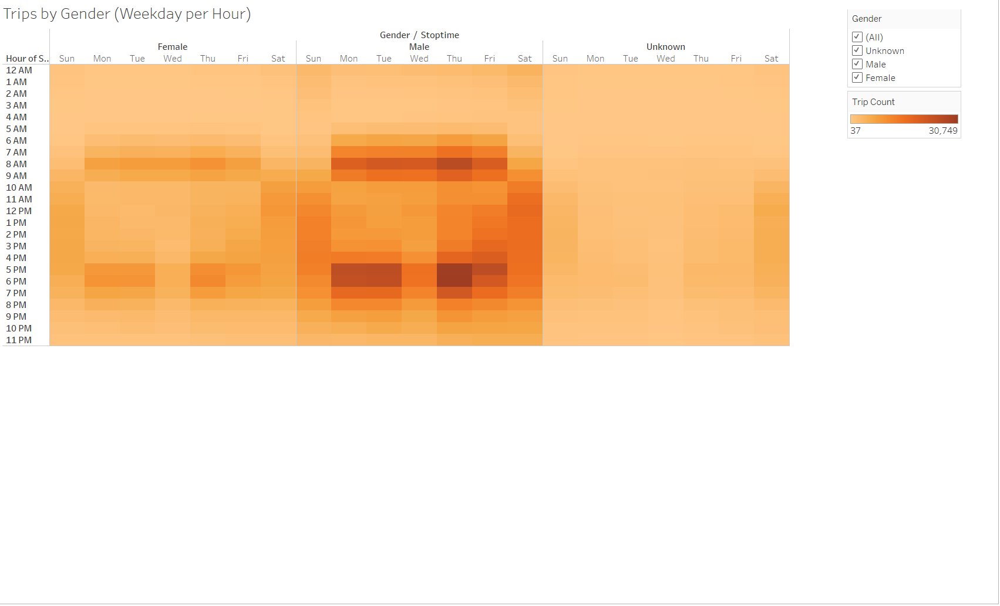
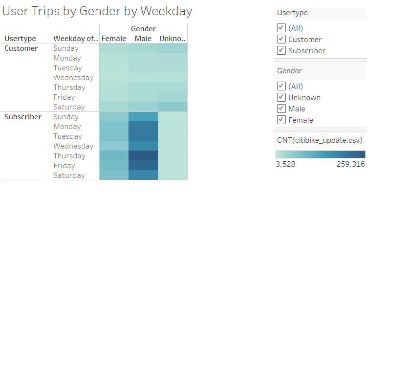

# Citi Bike Share Analysis

## Overview of Project

The purpose of this analysis was to create a story using the Tableau app. The goal was to convince investors that a bike-sharing program in Des Moines is a solid business proposal. Here are the results after converting the data file into the correct time format. To view the whole story from this analysis, please click [here](https://public.tableau.com/app/profile/brandon.sangster/viz/CitiBikeAnalysis_16789351138650/NYCCitiBikeAnalysis?publish=yes) to view the public Tableau.

## Results

#### The first thing I looked at was which gender was using the program the most.
-----------------------------------------

#### The following map below shows that most users start to use the servive within the city.
------------------------------------------

#### This graph displays the duration of each rider's use of the bikes. The bikes are often returned within one hour.
------------------------------------------

#### The identical table style is used, but it reveals that men use it for only approximately 20 minutes on average. This is probably for people who commute by bicycle.
--------------------------------------------

#### This heatmap was created to reiterate that most users are using it to and from work. Notice the trip counts at 5pm and 8am on weekdays.
------------------------------------------

#### Remember when I mentioned it was mostly males that used it for work, I confirmed it by using the same heatmap and seperate the genders.
-------------------------------------------

#### Final thing I wanted to check was the difference between customers and subscribers on a heatmap. It cleary shows most subscribers commute to work. 
------------------------------------------

## Summary
       
After completing this analysis, I would highly suggust gathering more data for other genders that are not male. This would allow us to pinpoint how all genders enjoy the service. I also would like to mention that investors would love this bike service if we start pushing it in a green enviorment sytle campaign. That way, more users would feel safe if mutilple people were commuting the same way via bike. 
